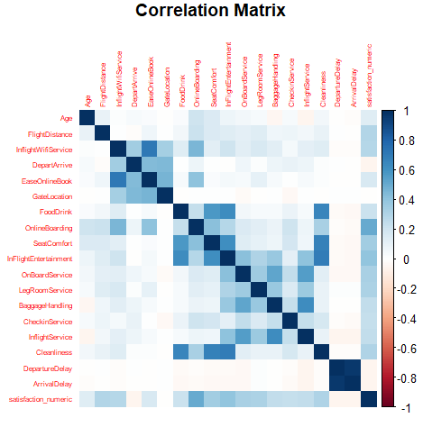
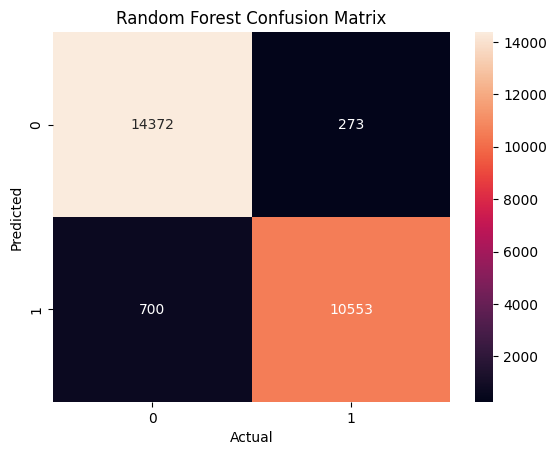
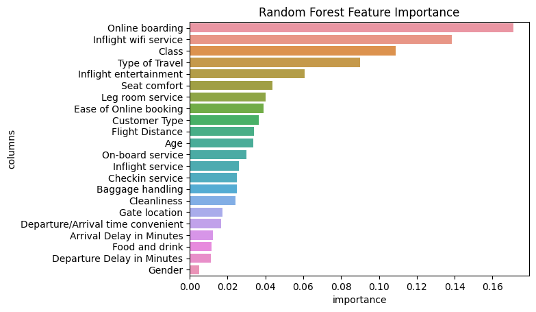
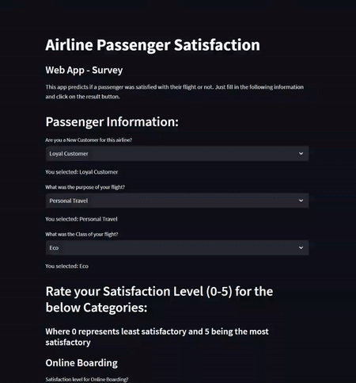

<h1 align="center">Airline Satisfaction Prediction APP</h1>

  

  
  
  
  
  
  
  
  

  

    Badge <a href="https://shields.io/">Source</a>
  

  <h2>Authors</h2>
  <ul>
    <li><a href="https://github.com/luisosorio3214">@luisosorio3214</a></li>
  </ul>

  <h2>Table of Contents</h2>
  <ul>
    <li><a href="#business-problem" target="_parent">Business Problem</a></li>
    <li><a href="#data-source">Data Source</a></li>
    <li><a href="#methods">Methods</a></li>
    <li><a href="#tech-stack">Tech Stack</a></li>
    <li><a href="#quick-glance">Quick glance at the Results</a></li>
    <li><a href="#lesson-learned">Lessons learned and Recommendation</a></li>
    <li><a href="#limitation">Limitation and what can be Improved</a></li>
    <li><a href="#local">Run Locally</a></li>
    <li><a href="#notebook">Explore the notebook</a></li>
    <li><a href="#report">Report and Presentation</a></li>
    <li><a href="#streamlit">Deployment on streamlit</a></li>
    <li><a href="#deployed">App deployed on streamlit</a></li>
    <li><a href="#contribution">Contribution</a></li>
    <li><a href="#license">License</a></li>
  </ul>

  <section id="business-problem">
    <h2>Business Problem</h2>
    

      An airline brand has been receiving a fair amount of unsatisfactory sentiment towards our flight services. We want to identify the root causes that our passengers are having for these sentiments and overall increase airline satisfaction for our particular brand. Over a certain period we recorded surveys on our passengers to provide more details about their experience by asking specific questions that may hint us in what we can improve on. In order to achieve this we must first create a machine learning model that accurately predicts a passenger satisfactory level using their response for certain customer service categories. We want to increase customer retention and believe if we make the customer happy they are more likely to use our services again.
    

  </section>

  <section id="data-source">
    <h2>Data Source</h2>
    <ul>
      <li><a href="https://www.kaggle.com/datasets/johndddddd/customer-satisfaction">Kaggle Dataset</a></li>
    </ul>
  </section>

  <section id="methods">
    <h2>Methods</h2>
    <ul>
      <li>Exploratory Data Analysis</li>
      <li>Multivariate Analysis</li>
      <li>Visualizations</li>
      <li>Modeling</li>
      <li>Reporting</li>
      <li>App Deployment</li>
    </ul>
  </section>

  <section id="tech-stack">
    <h2>Tech Stack</h2>
    <ul>
      <li>R (Data Cleansing and Exploratory Analysis)
      <li>Python (Machine Learning MOdeling and App preparation)</li>
      <li>Streamlit (Interface for model)</li>
    </ul>
  </section>

  <section id="quick-glance">
    <h2>Quick Glance at the Results</h2>
    

      Correlation Matrix between numeric features.
      

        
      

    
  
    

      Confusion Matrix of Random Forest Classifier.
      

        
      

    

    

      Random Forest Feature Importance Plot.
      

        
      

    

    

      Top 3 models on the testing set (with default parameters)
      <table style="width:100%">
        <tr>
          <th>Model</th>
          <th>Accuracy</th>
          <th>Sensitivity</th>
          <th>Specificity (Recall)</th>
        </tr>
        <tr>
          <td>Logistic Regression</td>
          <td>87.5%</td>
          <td>90.4%</td>
          <td>83.7%</td>
        </tr>
        <tr>
          <td>Random Forest</td>
          <td>96.5%</td>
          <td>98.2%</td>
          <td>94.2%</td>
        </tr>
        <tr>
          <td>Gradient Boosting</td>
          <td>95.4%</td>
          <td>97.1%</td>
          <td>93%</td>
        </tr>
      </table>
      

      

        <ul>
          <li>Final Model used: Random Forest Classifier</li>
          <li>Why choose Random Forest Classifier compared to the other models: The reason why Random Forest Classifier was the chosen model was that it provided better metrics not only in terms of accuracy but also in other metrics such as sensitivity, specificity, and precision. The precision score gave about 97.47% and overall is a better metric when it comes down to classifying a target with imbalance classes. OUr target variable, satisfaction level, had more unsatisfactory/neutral compared to satisfactory passengers based on our surveys. Also Random Forest is able to provide feature importance based on the splitting of various trees by determining which split/node provides the overall greatest decrease in gini index. This what provides further insights on our passengers view and what impacts satisfaction level the most. However, using Logistic Regression or Boosting would have been sufficient for analysis since there was not a huge difference in our metric scores.</li>
          <li>Metric used: Specificity</li>
          <li>Why choose Specificity as a metric: Our response variable in what we are trying to predict satisfaction level had imbalance classes. This creates a problem for our machine learning algorithm since they cannot learn each class at the same level. Therefore, our machine learning model might learn unsatisfactory/neutral passengers better since we were given more observations on them. Since we want to determine passenger with satisfactory level accurately this is only given when our specificity score is the greatest. If you look at the confusion matrix above we can see 1: represent satisfactory and 0: represents unsatisfactory/neutral passengers. Therefore, we want to increase our true positive, the lower right corner of the confusion matrix, which is our specificity score referred to as our recall score.</li>
        </ul>
      

    

  </section>

  <section id="lesson-learned">
  <h2>Lessons Learned and Recommendation</h2>
  

    <ul>
      <li>In this project I learned how to leverage feature importance using our Random Forest and Gradient Boosting models to determine what influences our response the most. Its important to note that some features might provide a negative influence to our response variable or a positive one. Since the goal for this project is to increase satisfactory level, we want to identify not only the top important features but also the ones that provide positive influence. For example, Cleanliness is a feature given and some logic would say as we decrease cleanliness so would satisfaction levels. This can also be said in reverse if we increase cleanliness then you would expect customers to be more satisfied with their experience, thus this feature provides a positive influence. A negative influence would say if we increase a feature then satisfaction level would decrease or vice-versa.</li> 
    </ul>
  

  <section id="limitation">
    <h2>Limitation and what can be Improved</h2>
    

      <ul>
        <li>Some limitations that were provided or not not considered in this project are other external factors. For example our observations in the data set did not provide a ticket fare amount for each passenger. In some sense a person who paid a higher fare for their ticket will be given a higher level of service through out their travel which overall increase their satisfaction level for the particular airline.</li>
        <li>Another piece of information lacking in our data was given a passenger companionship. For example, did the passenger travel alone or did they travel with friends/family. Understanding this would provide further insights on the reason why the passenger was traveling, for vacation, business, or emergency. These scenarios might have an overall effect on their airline experience since external factors might have already contributed to their mood.</li>
        <li>A final question we can ask is whether a person income level has an influence on their satisfaction level of their airline. If we were given a passengers income, we can further classify the passenger into several brackets such as lower, middle, and high class groups. Since money over all gives you access to better features and services their satisfaction level might be easier met.</li>
      </ul>
    

  </section>

  <section id="local">
    <h2>Run Locally</h2>
    

      First, Open your Command line or Terminal and head to a directory where you want to save the project.
    
    
      <h4>Initialize git</h4>
        <pre>
          <code style="height: 50%;">
          git init
          </code>
        </pre>
      <h4>Clone the Project</h4>
        <pre>
          <code style="height: 50%;">
          git clone https://github.com/luisosorio3214/Airline-Satisfaction-Prediction-App.git
          </code>
        </pre>
      <h4>Head to project directory</h4>
        <pre>
          <code style="height: 50%;">
          cd Airline-Satisfaction-Prediction-App
          </code>
        </pre>
      <h4>Create a virtual environment using venv</h4>
        <pre>
          <code style="height: 50%;">
          python -m venv "env_name"
          </code>
        </pre>   
      <h4>Activate virtual environment</h4>
        <pre>
          For Window Users
          <code style="height: 50%;">
            env_name\Scripts\activate
          </code>
          For Mac Users
          <code style="height: 50%;">
            source env_name/bin/activate
          </code>
        </pre>
      <h4>Install required dependencies from requirements.txt file</h4>
        <pre>
          <code style="height: 50%;">
          pip install -r requirements.txt
          </code>
        </pre>
      <h4>Start the streamlit server locally</h4>
        <pre>
          <code style="height: 50%;">
          streamlit run app.py
          </code>
        </pre>
    

    If you are having issues with streamlit, please follow this <a href="https://docs.streamlit.io/library/get-started/installation">tutorial on how to set up streamlit</a>. 
    

  </section>

  <section id="notebook">
  <h2>Explore the R Markdown Notebook</h2>
  

    To explore the R notebook file click <a href="https://luisosorio3214.github.io/Machine-Learning-Project-R/Airline%20Statisfaction%20Analysis/">here</a>.
  

  </section>

  <section id="report">
  <h2>Report and Presentation</h2>
  
The Report and Presentation was done collaboratively with other students at Long Beach State University. I express my gratitude and say thank you for the work they provided.

  

    To See Full <ul>Report</ul> of Analysis click <a href="https://github.com/luisosorio3214/Machine-Learning-Project-R/blob/main/Airline%20Statisfaction%20Analysis/Report%20%26%20PowerPoint%2C%20rmd%20file/Airline_Satisfaction_Report.pdf">here</a>.
  

  

    To see the Full <ul>Presentation</ul> given click <a href="https://docs.google.com/presentation/d/1xNGO3d_qEDKc9R28YX31pVfr07BD6VNu/edit?usp=sharing&ouid=100743082681367568996&rtpof=true&sd=true"> here</a>.
  

  </section>

  <section id="streamlit">
  <h2>Deployment on streamlit</h2>
  

    To deploy this project on streamlit share, follow these steps:
    <ol>
      <li>Make sure you have a github repository with full project files including the requirements.txt file</li>
      <li>Go to streamlit <a href="https://share.streamlit.io/">share</a></li>
      <li>Login with Github, Google, etc.</li>
      <li>click on new button</li>
      <li>Select the GitHub repo, branch, python file with the streamlit codes</li>
      <li>Click Save and Deploy</li>
    </ol>
  

  </section>

  <section id="deployed">
  <h2>App deployed on Streamlit</h2>
  
  

    Video to gif <a href="https://ezgif.com/">tool</a>
  

  </section>

  <section id="contribution">
    <h2>Contribution</h2>
    

      Pull requests are welcome! For major changes, please open an issue first to discuss what you would like to change or contribute.
    

  </section>

  <section id="license">
    <h2>License</h2>
    

      MIT License    
      Copyright (c) 2022 Stern Semasuka    
      Permission is hereby granted, free of charge, to any person obtaining a copy
      of this software and associated documentation files (the "Software"), to deal
      in the Software without restriction, including without limitation the rights
      to use, copy, modify, merge, publish, distribute, sublicense, and/or sell
      copies of the Software, and to permit persons to whom the Software is
      furnished to do so, subject to the following conditions:    
      The above copyright notice and this permission notice shall be included in all
      copies or substantial portions of the Software.   
      THE SOFTWARE IS PROVIDED "AS IS", WITHOUT WARRANTY OF ANY KIND, EXPRESS OR
      IMPLIED, INCLUDING BUT NOT LIMITED TO THE WARRANTIES OF MERCHANTABILITY,
      FITNESS FOR A PARTICULAR PURPOSE AND NONINFRINGEMENT. IN NO EVENT SHALL THE
      AUTHORS OR COPYRIGHT HOLDERS BE LIABLE FOR ANY CLAIM, DAMAGES OR OTHER
      LIABILITY, WHETHER IN AN ACTION OF CONTRACT, TORT OR OTHERWISE, ARISING FROM,
      OUT OF OR IN CONNECTION WITH THE SOFTWARE OR THE USE OR OTHER DEALINGS IN THE
      SOFTWARE.   
      Learn more about <a href="https://choosealicense.com/licenses/mit/"> MIT </a> license
    

  </section>

